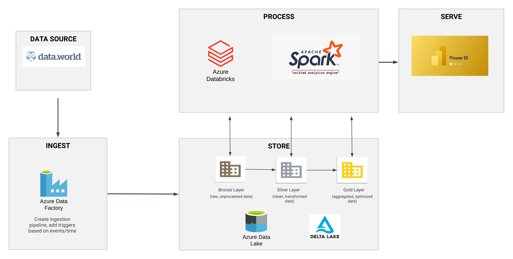

# Portfolio

Welcome to my portfolio. Below are some of the projects I have worked on. Each project includes an image, a description, and a link to the GitHub repository.

---

## Overview

- [Euroleague Dashboard App](#euroleague-dashboard-app)
- [Data Engineering project using Azure-Databricks-Pyspark](#data-engineering-project-using-azure-databricks-pyspark)

---

## [Euroleague Dashboard App](https://github.com/ThanasisKouras/Euroleague-dashboard-app)

**Description**:  
This is an Analytics Dashboard of Euroleague, exploring useful statistics about each **team** and each **player** of the selected team. The purpose of this dashboard is to provide an overview of basic and advanced stats in the fastest way possible. A demo of the app is provided below, to showcase its use.

**GitHub Repository**: [View on GitHub](https://github.com/ThanasisKouras/Euroleague-dashboard-app)

---

## [Data Engineering project using Azure-Databricks-Pyspark](https://github.com/ThanasisKouras/E-Commerce-Data-Engineering-project-Azure-Databricks-Pyspark)

**Description**:  
This project showcases the management, streamline, and data analysis of E-commerce data using Azure & Databricks. The project architecture is based on the Medallion Architecture, which organizes data processing into three distinct layers: bronze, silver, and gold. The bronze layer stores raw data, the silver layer cleanses and enriches it, and the gold layer provides refined, ready-for-analytics data.

**GitHub Repository**: [View on GitHub](https://github.com/ThanasisKouras/E-Commerce-Data-Engineering-project-Azure-Databricks-Pyspark)

---

## Project 3: [Project Title](#)

**Description**:  
A brief description of Project 3 goes here. Highlight key features, what you learned, and any relevant details that make this project stand out.

**GitHub Repository**: [View on GitHub](https://github.com/yourusername/project3)

---

## Project 4: [Project Title](#)

**Description**:  
A brief description of Project 4 goes here. Discuss the purpose of the project, the tools used, and your contributions.

**GitHub Repository**: [View on GitHub](https://github.com/yourusername/project4)

---

## Project 5: [Project Title](#)

**Description**:  
A brief description of Project 5 goes here. Provide a summary of the project and its significance, as well as any relevant technologies used.

**GitHub Repository**: [View on GitHub](https://github.com/yourusername/project5)

---

